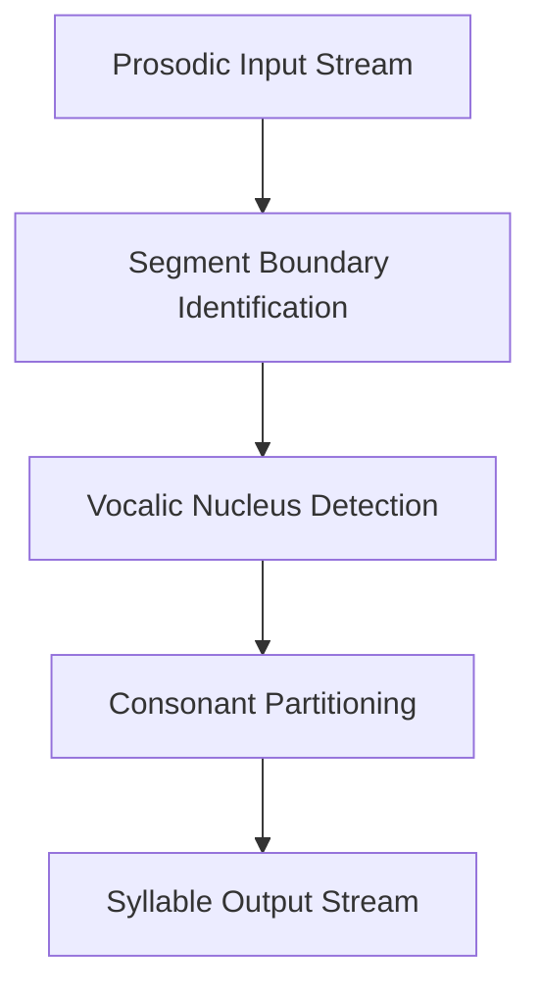

# Phonological Syllabification Rules

This document describes the linguistic theory and phonetic principles underlying the
syllabification of IPA sequences in the metonymy system. Rather than detailing software
implementation, this guide focuses on the phonological rules, constraints, and auditory processes
that govern how a continuous stream of speech sounds is segmented into syllables.

---

## The Linguistic Structure of the Syllable

In phonology, the syllable is a fundamental unit of organization for speech sounds. It is
structured hierarchically, consisting of the following acoustic parts:

*   **Onset**: The initial consonantal portion of the syllable, preceding the vocalic core.
*   **Rime**: The core and ending of the syllable, which is further subdivided into:
    *   **Nucleus**: The highly resonant core of the syllable (typically a vowel, diphthong, or
        syllabic consonant).
    *   **Coda**: The final consonants of the syllable following the nucleus.

A syllable is classically designated as $O.N.C$ (Onset, Nucleus, Coda). If a syllable ends in a
vowel (no coda), it is an **open syllable**. If it ends in one or more consonants (coda present),
it is a **closed syllable**.

---

## Core Phonetic Principles

The syllabification process applies several well-established phonological theories and physical
acoustic constraints to place syllable boundaries.

### 1. The Sonority Hierarchy
Sounds differ in their inherent resonance, or **sonority**. The sonority scale represents the
relative loudness of speech sounds compared to other sounds with the same length, stress, and
pitch. The hierarchy is organized as follows:

$$\text{Plosives} < \text{Fricatives} < \text{Nasals}
  < \text{Liquids} < \text{Glides} < \text{Vowels}$$

Within the sound system (defined in the database file
[ipa.json](../ipa/ipa.json)), this hierarchy is represented by
numerical sonority scores (0 to 100). For example:
*   **Plosives** (stops like `/p/`, `/t/`, `/k/`) have low sonority (~25–27).
*   **Fricatives** (like `/f/`, `/s/`, `/z/`) have slightly higher sonority (~45–47).
*   **Nasals** (like `/m/`, `/n/`) possess moderate sonority (~57).
*   **Liquids** (approximants like `/l/`, `/ɹ/`) have high consonantal sonority (~67).
*   **Vowels** (like `/a/`, `/i/`, `/u/`) form the peak of sonority (typically > 80).

### 2. The Sonority Sequencing Principle (SSP)
The SSP dictates that the sonority of a syllable must rise from the beginning of the onset toward
the nucleus peak, and then fall from the nucleus through the coda.
*   **Rising Sonority in Onset**: Consonants in an onset must become progressively more sonorous as
    they approach the vowel. For example, `/tr/` (plosive [25] &rarr; liquid [67]) has a valid
    sonority rise and is an admissible onset. Conversely, `/rt/` (liquid [67] &rarr; plosive [25])
    violates the SSP and cannot form an onset.
*   **The Sibilant Exception**: Sibilant fricatives (sounds with the `Strident` feature, like `/s/`)
    frequently violate the SSP in natural languages (e.g., English *stop*, *skin*). Sibilants are
    acoustically permitted at the very beginning of an onset cluster regardless of the sonority
    of the subsequent consonant (e.g., `/st/` is parsed as a valid onset).

### 3. The Maximal Onset Principle (MOP)
When a consonant cluster appears between two vocalic nuclei, the MOP states that the consonants
should be assigned to the onset of the second syllable rather than the coda of the first, as long
as the resulting onset is phonotactically legal in that language and satisfies the SSP.

---

## Phonological Constraints on Boundaries

While the Maximal Onset Principle prioritizes placing consonants into the onset of the following
syllable, several competing phonetic constraints can force consonants into the preceding coda:

### 1. Stressed Vowel Capture
A stressed, short, lax monophthong lacks the phonetic duration to stand alone as a well-formed
monosyllabic foot (in many languages, a stressed syllable must be heavy—either having a long
vowel or a coda consonant).
*   To satisfy this weight requirement, the stressed short vowel **captures** the immediately
    following consonant into its coda, even if that consonant could otherwise form a valid onset
    for the next syllable.
*   *Exceptions*: Glides and liquids are excluded from this capture mechanism due to their close
    acoustic proximity to the vowel, which would not provide a distinct consonantal boundary.

### 2. The Liquid Coda Constraint
Liquids (like `/l/`, `/ɹ/`) possess a high degree of sonority. When a liquid is the first consonant
in an intervocalic cluster, it is acoustically unstable as the start of an onset. It is
phonetically parsed into the preceding coda, preventing it from initiating the onset of the
succeeding syllable.

### 3. Geminate Splitting (Long Consonants)
Long (geminated) consonants (indicated by `/ː/`) represent a single phone that is phonetically
held. In speech production, geminates are split across the syllable boundary: the first portion
forms the coda of the preceding syllable, and the second portion forms the onset of the
following syllable.

### 4. Language-Specific Phonotactics
Languages restrict specific sequences of phonemes from being pronounced together in a single
onset. These illegal patterns (e.g., a rule preventing `/cz/` from starting a syllable,
configured in the schema at
[language.schema.json](file:///home/clementsd/rmetonymy/language/language.schema.json))
override the Maximal Onset Principle, forcing a syllable boundary between the illegal sequence
(yielding `...c.z...`).

---

## The Step-by-Step Phonetic Pipeline

The syllabification process models the auditory segmentation of a word through the following
stages:

### Stage 1: Segment Boundary Identification
Pre-existing prosodic markers (like primary stress `/ˈ/`, secondary stress `/ˌ/`, or explicit
syllable breaks `/./`) partition the phonetic input stream into distinct segments. Stress markers
assign stress levels to the vocalic cores within their domain.

### Stage 2: Vocalic Nucleus Detection
Within each segment, the vocalic peaks are identified:
*   **Diphthongs**: Vocalic sounds that are tied (using tie bars `/͡/` or breve modifiers `/̯/`)
    are treated as a single phonetic nucleus representing a continuous glide from one vowel
    quality to another.
*   **Monophthongs**: Untied vowels form individual, single-sound nuclei.

### Stage 3: Consonant Partitioning
For each consonant cluster between two adjacent nuclei:
1.  Check for long (geminated) consonants. If present, split the syllable boundary immediately
    after the geminate.
2.  Apply the **Stressed Vowel Capture** and **Liquid Coda** constraints to establish the minimum
    number of consonants that *must* remain in the left coda.
3.  Assign the remaining consonants to the right onset, working from the right to the left (toward
    the first nucleus).
4.  Test each proposed onset sequence against:
    *   The Sonority Sequencing Principle (SSP) (permitting the sibilant exception at the start).
    *   Language-specific phonotactics (illegal patterns).
5.  If the proposed onset is invalid, shift the leftmost consonant of the proposed onset into the
    left coda and repeat the test. If no valid onset can be formed, all consonants are assigned
    to the preceding coda.

---

## Concrete Trace Examples

### 1. Basic Sonority: `wɔkɪŋ` &rarr; `wɔ.kɪŋ`
*   **Nuclei**: Vowels `ɔ` and `ɪ`.
*   **Consonant Cluster**: `[k]`.
*   **Evaluation**: Since there is no stress, stressed capture is inactive. The consonant `[k]` is a
    plosive, not a liquid, so the liquid coda constraint is inactive.
*   **Maximal Onset Principle**: The consonant `/k/` is shifted to the onset of the second syllable
    (`[kɪŋ]`). The onset `/k/` is phonetically valid.
*   **Phonetic Result**: `wɔ.kɪŋ` (an open syllable followed by a closed syllable).

### 2. Stressed Vowel Capture: `pəˈlɪtɪkəl` &rarr; `pəˈlɪt.ɪ.kəl`
*   **Prosodic Segments**: Bounded by `/ˈ/` into `pə` and `lɪtɪkəl`.
*   **Segment 2 Analysis**:
    *   **Boundary 1** (between `/ɪ/` and `/ɪ/`):
        *   Consonant Cluster: `[t]`.
        *   The vowel `/ɪ/` is stressed, short, and non-rhotic. The following
            consonant `/t/` is a stop (neither a liquid nor a glide).
        *   **Stressed Capture**: The stressed `/ɪ/` captures `/t/` into its coda to form a heavy
            syllable. The onset of the next syllable is left empty.
        *   Boundary falls after `/t/` (`ˈlɪt.ɪ`).
    *   **Boundary 2** (between `/ɪ/` and `/ə/`):
        *   Consonant Cluster: `[k]`.
        *   The left vowel `/ɪ/` is unstressed in this segment, so no capture occurs.
        *   **Maximal Onset Principle**: The consonant `/k/` is assigned to the onset of the final
            syllable.
        *   Boundary falls before `/k/` (`ɪ.kəl`).
*   **Phonetic Result**: `pəˈlɪt.ɪ.kəl`

### 3. Liquid Coda Constraint: `ˈfɑɹmɚ` &rarr; `ˈfɑɹ.mɚ`
*   **Nuclei**: Vowels `/ɑ/` and `/ɚ/`.
*   **Consonant Cluster**: `[ɹ, m]`.
*   **Evaluation**:
    *   The first consonant `/ɹ/` is a liquid.
    *   **Liquid Coda Constraint**: Due to the high sonority of the liquid
        `/ɹ/`, it cannot initiate the onset of the following syllable. It must remain in the
        coda of the first syllable.
    *   The remaining consonant `/m/` is evaluated as the onset of the second syllable. `/m/` is a
        nasal and forms a valid single-consonant onset.
*   **Phonetic Result**: `ˈfɑɹ.mɚ`

### 4. Sonority Sequencing & Sibilant Exception
Trace for: `ˌæstrəˈnɒmɪkəl` &rarr; `ˌæs.trəˈnɒm.ɪ.kəl`
*   **Prosodic Segments**: `æstrə` (secondary stress) and `nɒmɪkəl` (primary stress).
*   **Segment 1 Analysis**:
    *   Consonant Cluster: `[s, t, r]` between `/æ/` and `/ə/`.
    *   **Stressed Capture**: The vowel `/æ/` is short and stressed. The first consonant is `/s/`,
        which is a sibilant fricative (not a liquid or glide).
        *   The stressed `/æ/` captures `/s/` into its coda, leaving `[t, r]` for the next onset.
    *   **Onset Evaluation**: The remaining cluster `[t, r]` is proposed as the next onset.
        *   SSP Check: `/t/` (plosive [25]) &rarr; `/r/` (liquid [67]) shows a
            clear rising sonority. This is a valid onset.
        *   Boundary falls after `/s/` (`ˌæs.trə`).
*   **Segment 2 Analysis**:
    *   **Boundary 1** (between `/ɒ/` and `/ɪ/`):
        *   Consonant Cluster: `[m]`.
        *   The vowel `/ɒ/` is short and stressed. The consonant `/m/` is a nasal.
        *   **Stressed Capture**: `/ɒ/` captures `/m/` into its coda.
        *   Boundary falls after `/m/` (`ˈnɒm.ɪ`).
    *   **Boundary 2** (between `/ɪ/` and `/ə/`):
        *   Consonant Cluster: `[k]`.
        *   No capture occurs because `/ɪ/` is unstressed.
        *   Boundary falls before `/k/` (`ɪ.kəl`).
*   **Phonetic Result**: `ˌæs.trəˈnɒm.ɪ.kəl`

### 5. Illegal Onset Pattern: `acza` &rarr; `ac.za`
*   **Nuclei**: Vowels `/a/` and `/a/`.
*   **Consonant Cluster**: `[c, z]`.
*   **Onset Evaluation**:
    *   **Maximal Onset Principle**: The algorithm proposes `[c, z]` as the onset of the second
        syllable.
    *   **Phonotactic Constraint**: The language config defines `/cz/` as an illegal onset pattern.
    *   Since the onset is illegal, the leftmost consonant `/c/` is shifted back into the coda of
        the first syllable, leaving `[z]` as the proposed onset.
    *   The single-consonant onset `/z/` is legal.
*   **Phonetic Result**: `ac.za`

### 6. Vocalic Diphthongs: `ki̯el` &rarr; `ki̯el`
*   **Phonetic Stream**: The sequence `/ki̯el/` contains three vocalic sounds: `/i/`, `/e/`, and
    `/l/` (if `/l/` is treated as a consonant). But `/i/` has a breve modifier (`/i̯/`), indicating
    it is tied.
*   **Nuclei Detection**:
    *   The tied `/i̯/` and `/e/` form a single vocalic diphthong nucleus `/i̯e/`.
    *   The single nucleus means there is only one syllable, and no division is made.
*   **Phonetic Result**: `ki̯el` (a single syllable containing onset `/k/`, nucleus `/i̯e/`,
    and coda `/l/`).
